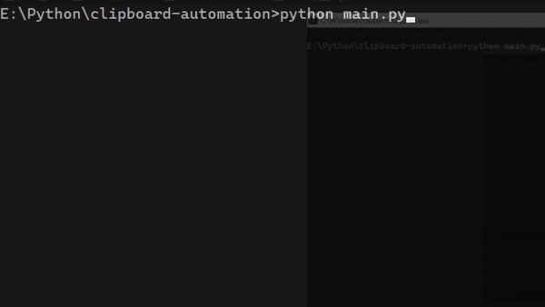
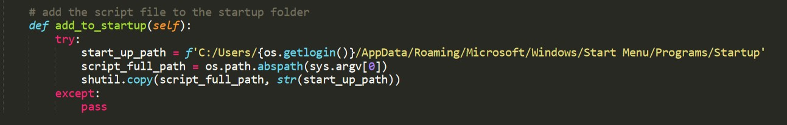
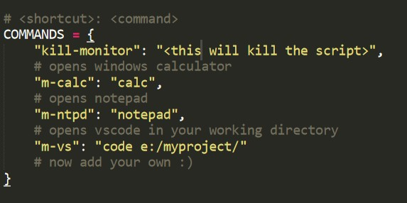
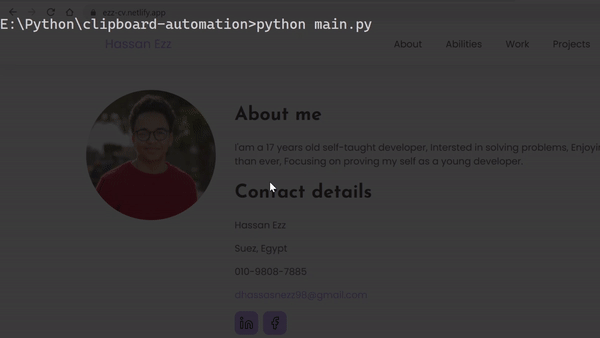

# 📝 Auto clipboard

Auto clipboard is a simple clipboard monitor script written in <code>Python3</code> made to automate tasks by copying text.

<!-- ============================ -->
## How it works
It simply listens for clipboard changes and take actions based on the copied text.
now for example if we added the following command

`"ntpd": "notepad"`

Now when we copy the text <code>ntpd</code> it will automatically execute the <code>notepad</code> comman.

<!-- ============================ -->
## Features

- Command Execution
~~~python
...

COMMANDS = {
	"kill-monitor": "<this will kill the script>",
	"m-calc": "calc",
	"m-ntpd": "notepad",
	"m-vs": "code e:/myproject"
}

...
~~~

- Adding it self to startup

- Hiding the console 
~~~python

...

def hide_console(self):
  app = win32gui.GetForegroundWindow()
  win32gui.ShowWindow(app , win32con.SW_HIDE)

...

m.hide_console()

~~~

<!-- ============================ -->
## Executing commands
In the commands variable, add your shorcut text with the command you want to execute, as shown in the picture.

<!-- ============================ -->
## killer switch

If you want to stop the script, just copy what is in the <code>CLOSE_COMMAND</code> variable

~~~python

...

CLOSE_COMMAND = 'close-monitor'

...

if clipboard == CLOSE_COMMAND:
  self.flag = 0 # which stops the while loop and the script
~~~

<!-- ============================ -->
### Simple example

<!-- ============================ -->
## Installation

You will need to install this python module
 
`~$ pip3 install pyperclip win32gui win32con`
 
then, run
 
`~$ python3 main.py`

